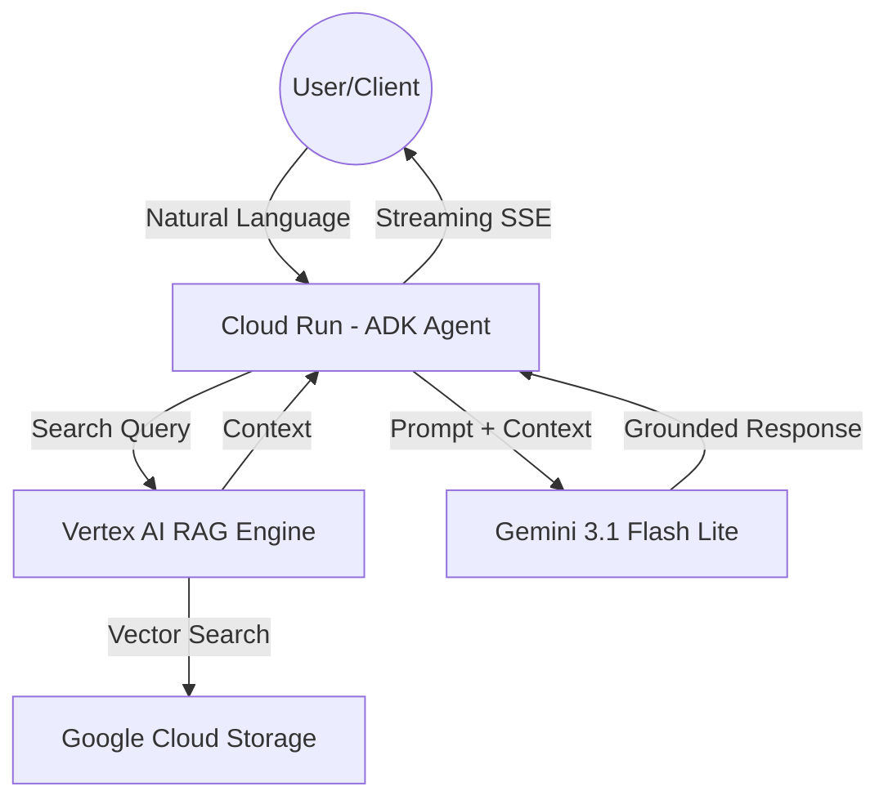

# Demo-RAG-Vertex: Enterprise-Grade RAG Engine

A production-ready Retrieval-Augmented Generation (RAG) system built using Google's **Agent Development Kit (ADK)**, **Vertex AI RAG Engine**, and **Cloud Run**. This project demonstrates how to orchestrate private document collections with foundational LLMs to provide grounded, fact-based AI responses.

---

## 🌟 Executive Summary

In the era of Generative AI, the biggest challenge for enterprises is **hallucination** and **data privacy**. `Demo-RAG-Vertex` solves this by:
- **Grounding:** Ensuring AI responses are based strictly on *your* private data.
- **Security:** Keeping data within your GCP perimeter using IAM and VPC-native services.
- **Scalability:** Leveraging Serverless Cloud Run to handle thousands of requests with zero infrastructure management.
- **Interoperability:** Seamlessly integrating with **Gemini Enterprise** for high-performance reasoning and enterprise-grade SLA/Compliance.

---

## 🏗️ Architecture & Workflow

### High-Level Architecture


### Technical Stack
- **Orchestration:** [Google ADK](https://google.github.io/adk-docs/) - Framework for building tool-use agents.
- **Retrieval:** [Vertex AI RAG Engine](https://cloud.google.com/vertex-ai/docs/generative-ai/rag/overview) - Managed vector database and ingestion pipeline.
- **Storage:** Google Cloud Storage (GCS) - Raw document storage.
- **Model:** `gemini-3.1-flash-lite` - High-speed, low-latency reasoning.
- **Hosting:** Google Cloud Run - Scalable, containerized deployment.

---

## 🔄 Core Workflows

### 1. Data Ingestion
- **Step 1:** Upload documents (PDF, TXT, HTML) to a designated GCS bucket.
- **Step 2:** The Agent uses the `import_document_to_corpus` tool.
- **Step 3:** Vertex AI automatically chunks the files, generates embeddings, and indexes them.

### 2. Semantic Search & Reasoning
- **Step 1:** User asks a question (e.g., "What is our policy on remote work?").
- **Step 2:** Agent determines it needs private context and calls `search_all_corpora`.
- **Step 3:** The Agent injects the retrieved snippets into the Gemini prompt as "System Context".
- **Step 4:** Gemini generates a response with mandatory citations.

---

## 🔌 API & Integrations

The system exposes a FastAPI-based REST interface.

### Key Endpoints
- `POST /run_sse`: Main interaction endpoint. Supports Server-Sent Events (SSE) for real-time streaming.
- `POST /apps/app/users/{user_id}/sessions`: Manage conversation history and state.
- `GET /docs`: Auto-generated Swagger documentation for technical teams.

### Tool Integrations
The agent is equipped with a suite of functional tools:
- **GCS Tools:** `create_bucket`, `list_buckets`, `upload_file`.
- **RAG Tools:** `create_corpus`, `import_document`, `query_rag_corpus`.
- **Memory Tools:** `load_memory` for long-term context retention.

---

## 💎 Gemini Enterprise Integration

This project is optimized for **Gemini Enterprise**, providing:
1. **Managed Safety:** Leverages enterprise-grade safety filters and content moderation.
2. **Data Residency:** Configurable regional endpoints (e.g., `us-central1`, `europe-west1`) to comply with local data laws.
3. **IAM Security:** Deep integration with Google Cloud IAM. Uses Service Account impersonation to ensure the "Principle of Least Privilege".
4. **Provisioned Throughput:** Supports high-scale production workloads with guaranteed model availability.

---

## 🛠️ Developer Guide

### Local Setup
1. **Install Dependencies:**
   ```bash
   pip install -r requirements.txt
   ```
2. **Set Environment:**
   ```bash
   export GOOGLE_CLOUD_PROJECT="<YOUR_PROJECT_ID>"
   export GOOGLE_CLOUD_LOCATION="us-central1"
   ```
3. **Run App:**
   ```bash
   agents-cli run "List all RAG corpora"
   ```

### Deployment
The project is scaffolded for automated deployment via `agents-cli`:
```bash
agents-cli deploy --project <YOUR_PROJECT_ID> --region us-central1 --memory 1Gi
```

---

## 📈 Business Stakeholder Info

| Metric | Benefit |
| :--- | :--- |
| **Accuracy** | Drastically reduces hallucinations by grounding in specific corpora. |
| **Time-to-Value** | "Zero-config" vector search; no need to manage Elasticsearch or Pinecone. |
| **Cost** | Uses `flash-lite` models and serverless scaling to minimize GCP spend. |
| **Compliance** | Data never leaves the GCP environment; supports Data Residency and Enterprise Safety. |

---

*Built by the ADK Team for [bdelph79/demo-rag-vertex](https://github.com/bdelph79/demo-rag-vertex)*