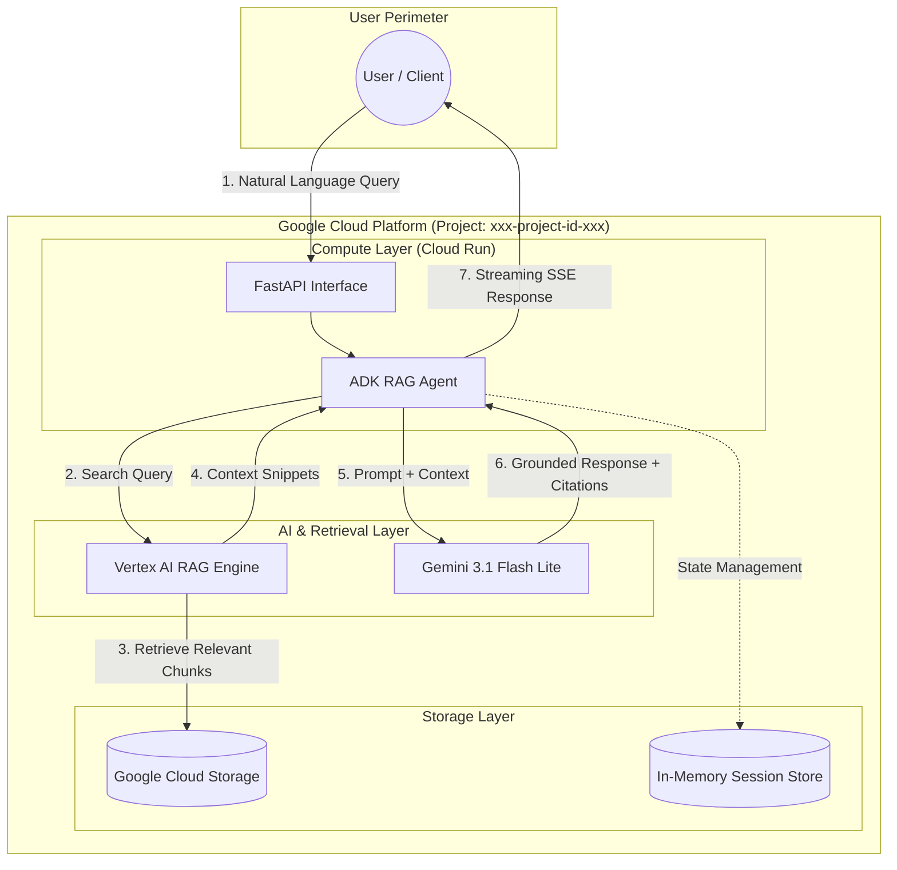

# Demo-RAG-Vertex: Enterprise-Grade RAG Engine

A production-ready Retrieval-Augmented Generation (RAG) system built with Google's **Agent Development Kit (ADK)**, **Vertex AI RAG Engine**, and **Cloud Run**. This project demonstrates how to securely orchestrate private document collections with foundational LLMs to provide grounded, fact-based AI responses with full citations.

---

## 🏗️ Architecture Diagram

The following diagram illustrates the secure data flow and component interactions within the GCP environment:



---

## 🌟 Executive & Business Summary

For stakeholders, `Demo-RAG-Vertex` provides a high-ROI pathway to operationalizing Generative AI:

-   **Zero Hallucination (Grounding):** Responses are strictly derived from provided corpora, not general training data.
-   **Enterprise Data Privacy:** All document processing, embedding, and reasoning occur within your GCP project boundary.
-   **Cost Efficiency:** Leverages `gemini-3.1-flash-lite` for high-performance reasoning at a fraction of the cost of larger models.
-   **Rapid Deployment:** Serverless architecture (Cloud Run) scales to zero when not in use, eliminating idle infrastructure costs.

---

## 🔄 Core Workflows

### 1. Data Ingestion & Indexing
1.  **Storage:** Documents (PDFs, TXT, HTML) are uploaded to secure GCS buckets.
2.  **Indexing:** The agent triggers the Vertex AI RAG Engine to automatically chunk documents, generate vector embeddings (using `text-embedding-004`), and update the managed index.
3.  **Lifecycle:** Tools are provided to list, update, and delete corpora and files dynamically.

### 2. Semantic Search & Reasoning
1.  **Intent Discovery:** The ADK agent analyzes user queries to determine if private data access is required.
2.  **Retrieval:** It performs a similarity search across one or all available corpora.
3.  **Synthesis:** Retreived context is injected into the Gemini model prompt.
4.  **Verification:** The model produces a response accompanied by mandatory source citations (Corpus Name/ID).

---

## 🔌 API & System Integrations

### Exposed REST Endpoints
-   `POST /run_sse`: The primary interaction gateway. Uses Server-Sent Events (SSE) for real-time, low-latency streaming of agent thoughts and final responses.
-   `POST /apps/app/users/{user_id}/sessions`: Creates and manages conversational state, enabling long-running multi-turn interactions.
-   `GET /docs`: Comprehensive Swagger/OpenAPI documentation for developer onboarding.

### Integrated Service Tools
The agent has native "tool-calling" capabilities for:
-   **Storage:** `create_gcs_bucket`, `upload_file_to_gcs`, `list_blobs_in_bucket`.
-   **RAG:** `create_rag_corpus`, `import_document_to_corpus`, `search_all_corpora`.
-   **Memory:** `load_memory` for historical context retrieval.

---

## 💎 Gemini Enterprise Integration

This solution is optimized for **Gemini Enterprise** environments:
-   **Regional Compliance:** Configurable for any Vertex AI supported region (e.g., `us-central1`, `europe-west1`) to meet data residency requirements.
-   **Identity-Based Security:** Leverages IAM Service Accounts. Public access is controlled via `allUsers` role binding on Cloud Run, while backend AI calls are strictly authenticated.
-   **Enterprise Safety:** Inherits Google's foundational model safety settings, filtering for harmful content at the source.

---

## 🛠️ Deployment & Maintenance

### Sanitized Deployment Command
```bash
# Set project-specific environment variables
export GOOGLE_CLOUD_PROJECT="xxx-project-id-xxx"
export GOOGLE_CLOUD_LOCATION="us-central1"

# Deploy via Agents CLI
agents-cli deploy \
  --project $GOOGLE_CLOUD_PROJECT \
  --region $GOOGLE_CLOUD_LOCATION \
  --memory 1Gi \
  --update-env-vars GOOGLE_GENAI_USE_VERTEXAI=True
```

### Git Integrity
A hardened `.gitignore` is included to prevent the leakage of:
-   Local session databases (`.adk/`)
-   Environment secrets (`.env`)
-   Deployment metadata and Terraform state.

---
*Built for Scalability, Security, and Precision.*
